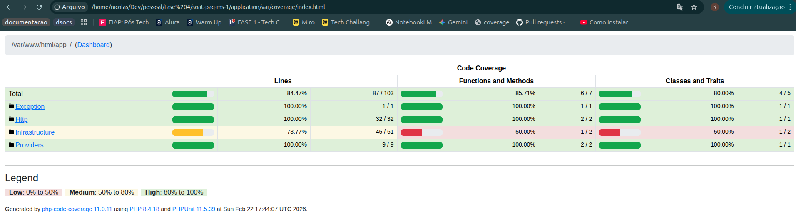
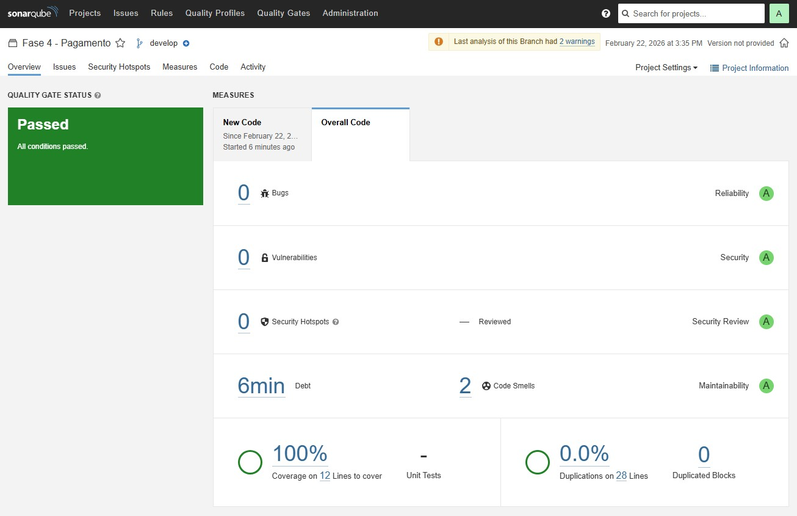

# Microsserviço de Pagamentos — Oficina SOAT

Microsserviço responsável pelo **processamento de pagamentos** das ordens de serviço da oficina mecânica SOAT, com integração ao **Mercado Pago** (PIX). É um dos 4 microsserviços independentes que compõem o sistema — trabalho de pós-graduação em Arquitetura de Software pela FIAP (Fase 4).

---

## Alunos

| Aluno | RM | Discord | LinkedIn |
|---|---|---|---|
| Felipe | 365154 | felipeoli7eira | [@felipeoli7eira](https://www.linkedin.com/in/felipeoli7eira) |
| Nicolas | 365746 | nic_hcm | [@Nicolas Martins](https://www.linkedin.com/in/nicolas-hcm) |
| William | 365973 | wllsistemas | [@William Francisco Leite](https://www.linkedin.com/in/williamfranciscoleite) |

---

## Material

- **Collection Postman / Swagger**: `soat-pag-ms.postman_collection.json`

---

## Sobre o Projeto

O sistema SOAT evoluiu de uma operação local para uma rede de oficinas mecânicas com escopo nacional e múltiplas filiais. Para suportar essa escala com resiliência e tolerância a falhas, o backend foi reestruturado em microsserviços independentes.

Este serviço — **soat-pag-ms** — é o responsável por todo o ciclo de pagamento das ordens aprovadas:

- **Pagamentos via PIX**: integração com a API do Mercado Pago para geração de QR Code e copia-e-cola
- **Eventos assíncronos**: consome e publica eventos de pagamento via RabbitMQ (Saga Pattern)
- **Persistência**: registros de pagamento armazenados em MongoDB

---

## Stack e Justificativas

### PHP 8.4 + Laravel 12
Framework maduro, com mais de 10 anos de ecossistema ativo e adoção massiva na indústria. Oferece injeção de dependência nativa (Service Container), ideal para implementar Clean Architecture sem acoplamento entre camadas. Facilita a criação de APIs RESTful com validação, roteamento e camada de autenticação prontos para uso.

### Nginx
Servidor HTTP com arquitetura assíncrona orientada a eventos — os worker processes são não-bloqueantes, lidando com múltiplas conexões simultâneas sem criar um processo por requisição. Isso resulta em alta eficiência de concorrência e menor consumo de memória em comparação com Apache MPM prefork. Utilizado em produção por Netflix, Airbnb e Dropbox.

### MongoDB 7
Banco de dados NoSQL orientado a documentos, escolhido por características específicas ao domínio de pagamentos:

- Esquema flexível para acomodar diferentes formatos de resposta da API Mercado Pago
- Alta performance em operações de leitura/escrita de documentos inteiros
- Integração nativa com Laravel via `mongodb/laravel-mongodb`
- Adequado para registros de transações financeiras que raramente precisam de JOINs complexos

### Mercado Pago SDK
Integração oficial com a API Mercado Pago via `mercadopago/dx-php`:

- Geração de cobranças PIX (copia-e-cola e QR Code)
- Recebimento de webhooks de confirmação de pagamento
- Ampla adoção no mercado brasileiro

### RabbitMQ
Broker de mensagens para comunicação assíncrona entre microsserviços via Saga Pattern:

- Consumo da fila `orcamento_aprovado` para iniciar o processamento do pagamento
- Publicação dos eventos `pagamento.gerado_sucesso` e `pagamento.gerado_erro`
- Driver `php-amqplib` com integração Laravel via `vladimir-yuldashev/laravel-queue-rabbitmq`

### Docker Compose
Orquestração local dos 3 serviços (nginx, php-fpm, mongodb) com build automatizado e configuração de rede interna. Reproduz o ambiente de produção de forma consistente em qualquer máquina.

---

## Arquitetura — Clean Architecture

```
Route → Api (Http layer) → Controller → UseCase → Gateway → Repository → Model/DB
```

### Camadas

| Camada | Localização | Responsabilidade |
|---|---|---|
| **Domain/Entity** | `app/Domain/Entity/{Entidade}/` | Objeto de domínio com validações, interface de repositório, mapper Model↔Entidade |
| **Domain/UseCase** | `app/Domain/UseCase/{Entidade}/` | Lógica de negócio |
| **Infrastructure/Gateway** | `app/Infrastructure/Gateway/` | Adaptador entre UseCase e Repository |
| **Infrastructure/Repositories** | `app/Infrastructure/Repositories/` | Implementações com acesso ao MongoDB |
| **Infrastructure/Service** | `app/Infrastructure/Service/` | Integrações externas (Mercado Pago) |
| **Infrastructure/Controller** | `app/Infrastructure/Controller/` | Orquestra use cases |
| **Http/** | `app/Http/` | Classes Api — recebem HTTP request, validam input, chamam controllers |
| **Infrastructure/Presenter** | `app/Infrastructure/Presenter/` | Formata resposta JSON `{ "err": bool, "dados": {...} }` |
| **Console/Commands** | `app/Console/Commands/` | Comando `app:saga` — escuta filas RabbitMQ e processa eventos |

### Convenções de domínio

- **UUID** como identificador público (gerado na criação); `id` é interno
- **Timestamps customizados**: `criado_em`, `atualizado_em`, `deletado_em`
- **Soft delete manual**: campo `deletado_em` nullable, sem uso da trait `SoftDeletes`
- **Exceções de domínio**: `DomainHttpException` com código HTTP embutido
- **Formato de erro**: `{ "err": true, "msg": "..." }`

---

## Entidades de Domínio

| Entidade | Atributos |
|---|---|
| **Pagamento** | uuid_ordem, status, link_pag, qr_code, qr_code_base64, dados_mp (resposta completa do Mercado Pago) |

---

## Endpoints da API

Prefixo base: `/api/`

| Método | Rota | Descrição | Auth |
|---|---|---|---|
| `GET` | `/api/ping` | Health check | Não |
| `GET` | `/api/ordem/{uuid}` | Consultar status de pagamento por UUID da ordem | Bearer JWT |
| `GET` | `/api/pagamento/mercado-pago-wh` | Webhook de notificações do Mercado Pago | Não |

Autenticação: **Bearer JWT** no header `Authorization` (middleware `JsonWebTokenMiddleware`).

---

## Setup Local

**Pré-requisitos**: Docker + Docker Compose

```bash
# 1. Clonar o repositório
git clone <url>
cd soat-pag-ms

# 2. Configurar variáveis de ambiente
cp application/.env.example application/.env
# Preencher MERCADO_PAGO_ACCESS_TOKEN e demais variáveis do Mercado Pago

# 3. Subir os containers (build automático)
docker compose up -d --build

# 4. Iniciar o listener de filas (Saga)
docker compose exec ms_pag php artisan app:saga
```

> **Nota**: o serviço depende do RabbitMQ (`soat_queue_worker`) e da rede Docker `soat-net`. Certifique-se de que a rede e o broker estejam ativos antes de subir este serviço.

### Portas

| Serviço | Porta host | Porta container |
|---|---|---|
| Nginx (API) | **8083** | 80 |
| MongoDB | **27017** | 27017 |
| PHP-FPM | interno | 9000 |

### Health check

```
GET http://localhost:8085/api/ping
→ { "err": false, "msg": "pong [pag-ms]" }
```

---

## Testes

> **Pré-requisito**: antes de rodar os testes pela primeira vez (ou após rebuild), instale as dependências de desenvolvimento:

```bash
docker compose exec ms_pag composer install
```

```bash
# Rodar todos os testes
docker compose exec ms_pag php artisan test

# Teste específico
docker compose exec ms_pag php artisan test --filter=NomeDoTeste

# Limpa config de cache + roda testes
docker compose exec ms_pag composer test

# Com relatório de cobertura (requer xdebug)
docker compose exec ms_pag php artisan test --coverage
```

### Estrutura

| Diretório | Escopo |
|---|---|
| `tests/Unit/` | Domain, Infrastructure, Exception |
| `tests/Feature/` | Endpoints HTTP completos (integração) |

Relatório HTML gerado em `application/var/coverage/`.
Relatório texto gerado em `application/var/coverage.txt`.

**Cobertura mínima exigida**: 80%

**Evidências Cobertura PHPUnit**: 



**Evidência SonarQube**: 

---

## CI/CD (GitHub Actions)

#### 1. Aprovação de um PR para merge com a `main`
No branch `main` são efetuados merges mediante aprovação dos PRs.

#### 2. Execução da Pipeline `database.yaml`
Ao executar o merge, é disparada a pipeline que executa os scripts terraform para provisionamento do serviço e container com `MongoDB`.

#### 3. Execução da Pipeline `application.yaml`
Após a pipeline **database** ser executada, será provisionado e executada a pipeline `application.yaml` que roda os seguintes jobs.
1. `Testes Unitários`
2. `Container Nginx`
3. `Container PHP-FPM`
4. `Deploy da aplicação`

---

## Saga Pattern

### Estratégia: Coreografado (Choreography-based Saga)

Não há orquestrador central. Cada microsserviço reage de forma autônoma a eventos publicados em filas de mensagens. A consistência eventual é garantida pelo encadeamento de eventos entre os serviços.

---

### Os 4 Microsserviços

| # | Serviço | Responsabilidade |
|---|---|---|
| 1 | **atores-ms** | Usuários, clientes, veículos; autenticação JWT |
| 2 | **estoque-ms** | Estoque de materiais e catálogo de serviços da oficina |
| 3 | **ordem-ms** | Ordens de serviço, orçamentos, nota fiscal PDF |
| 4 | **pag-ms** | Pagamento de ordens via Mercado Pago (PIX) |

Cada serviço possui seu próprio banco de dados (database-per-service). A comunicação síncrona entre MSs é feita via REST com o header `x-soat-ms-app-key`.

---

### Filas Mapeadas

- `ORDEM_CRIACAO`
- `ORDEM_MUDANCA_STATUS`
- `ESTOQUE_ORDEM_RESERVA`
- `ESTOQUE_ORDEM_DEBITAR_RESERVA`
- `ESTOQUE_ORDEM_CANCELAR_RESERVA`
- `ORDEM_PAGAMENTO_PENDENTE`
- `ORDEM_PAGAMENTO_CONFIRMADO`
- `ORDEM_PAGAMENTO_RECUSADO`

---

### Papel do pag-ms na Saga

O **pag-ms** é o participante responsável pela geração e confirmação de pagamentos no fluxo de saga das ordens de serviço.

---

### Fluxo — Pagamento de Ordem Aprovada

1. **ordem-ms** publica em `fila: orcamento_aprovado`
2. **pag-ms** consome `orcamento_aprovado` → chama a API Mercado Pago → gera PIX (copia-e-cola + QR Code) → persiste em MongoDB
3. **pag-ms** publica o resultado:
   - Sucesso → `pagamento.gerado_sucesso` (com dados do PIX)
   - Falha → `pagamento.gerado_erro`
4. **ordem-ms** consome o evento:
   - `pagamento.gerado_sucesso` → status da ordem muda para `AGUARDANDO_PAGAMENTO`
   - `pagamento.gerado_erro` → status da ordem muda para `ERRO_PAGAMENTO`

---

### Rollback e Compensação

| Situação | Compensação |
|---|---|
| Falha na geração do link de pagamento | **pag-ms** publica `pagamento.gerado_erro` → **ordem-ms** registra o erro e pode retentar ou cancelar a ordem |
| Pagamento não confirmado dentro do prazo | Expiração gerenciada pelo Mercado Pago; webhook notifica o resultado final |
| Ordem cancelada antes do pagamento | **ordem-ms** não aguarda retorno adicional do **pag-ms**; sem débito de estoque neste cenário |
